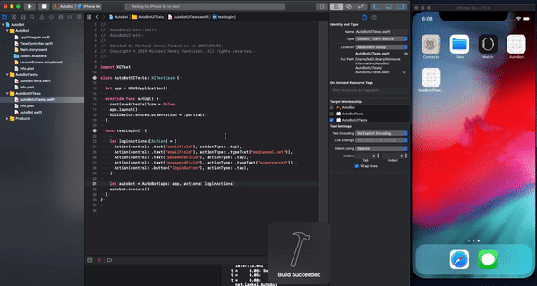

[](https://github.com/michaelhenry/AutoBot/actions)
[](https://github.com/michaelhenry/AutoBot/actions)
[](https://cocoapods.org/pods/AutoBot)
[](https://cocoapods.org/pods/AutoBot)
[](https://cocoapods.org/pods/AutoBot)
[](https://codebeat.co/projects/github-com-michaelhenry-autobot-master)

# AUTOBOT

A Tool for QA Testers and Developers.

**Testers** could create test cases from an admin page
while **Developers** could fetch and execute it inside the **XCode's UITesting target** via **API** automatically using **CI**.

## Sample IOS Test Cases

In the screenshot above, the code was executed like this, so imagine, this is `Codable`, we can just fetch this from any server and/or any file!

```swift
func testLogin() {
  let loginCommands:[Command] = [
    .action(.tap, for: .text("emailField")),
    .action(.typeText("me@iamkel.net"), for: .text("emailField")),
    .assert(.isEnabled(true), for: .text("emailField")),
    .assert(.isExists(true), for: .text("emailField")),
    .assert(.textValue("me@iamkel.net"), for: .text("emailField")),
    .action(.tap, for: .securedText("passwordField")),
    .action(.typeText("supersecret"), for: .securedText("passwordField")),
    .assert(.textValue("•••••••••••"), for: .securedText("passwordField")),
    .action(.tap, for: .button("loginButton")),
  ]
  autobot.execute(commands: loginCommands)
}
```

> Since Android has its own UITesting, this can be also implemented in Android SOON! So one test case for multiple platform!

## Documentations

- TODO

## Installation

AutoBot is available through [CocoaPods](https://cocoapods.org). To install
it, simply add the following line to your Podfile:

```ruby
pod 'AutoBot'
```

## Author

michaelhenry, me@iamkel.net

## License

AutoBot is available under the MIT license. See the LICENSE file for more info.


## Other tools that might help you too.

- [Localizr](https://github.com/michaelhenry/Localizr), Automates your **localization files** for `iOS` and `Android`
- [Hijackr](https://github.com/michaelhenry/Hijackr), Mock your `URLRequest`

## Limitations

- TODO
